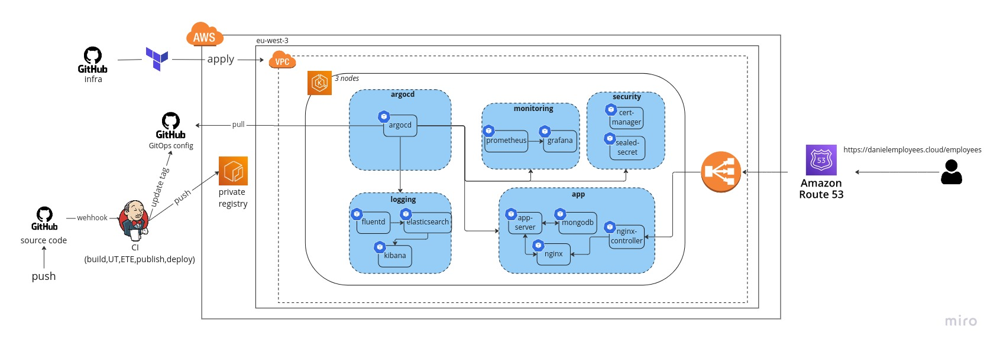

# Employees DevOps portfolio
## Infrastracture repository
This repository contains all the code necessary for provisioning the infrastructure required to run the application in the employees-gitops-config repository.

The infrastructure includes an EKS cluster with Kubernetes infrastructure.

The Kubernetes infrastructure is managed using Helm charts, which are stored in the employees-gitops-config repository.

To build the infrastructure, run the provision_cluster.sh script. Before running the script, please update the production.tfvars file with the required variables. Additionally, in the sealed-secret module, there is a k8s secret resource to configure the key of sealed-secret. It uses file("keys/tls.crt") and file("keys/tls.key"), so make sure to add these files.

## Requirments
To run the code in this repository, you will need to do the following:
1. Configure your AWS CLI with the necessary permissions to provision the infrastructure.
2. Update the production.tfvars file with the required variables.
3. Add the tls.crt and tls.key files to the keys directory (you need to create this directory).
4. Update the Route53 record in the record.json file to point to the ELB created by the script. Replace the 'Name' field with your own domain name, and replace the 'HostedZoneId' field with your hosted zone ID.

It is important to note that this repository is intended to be used in conjunction with the employees-gitops-config repository to provide a complete DevOps solution for the application.